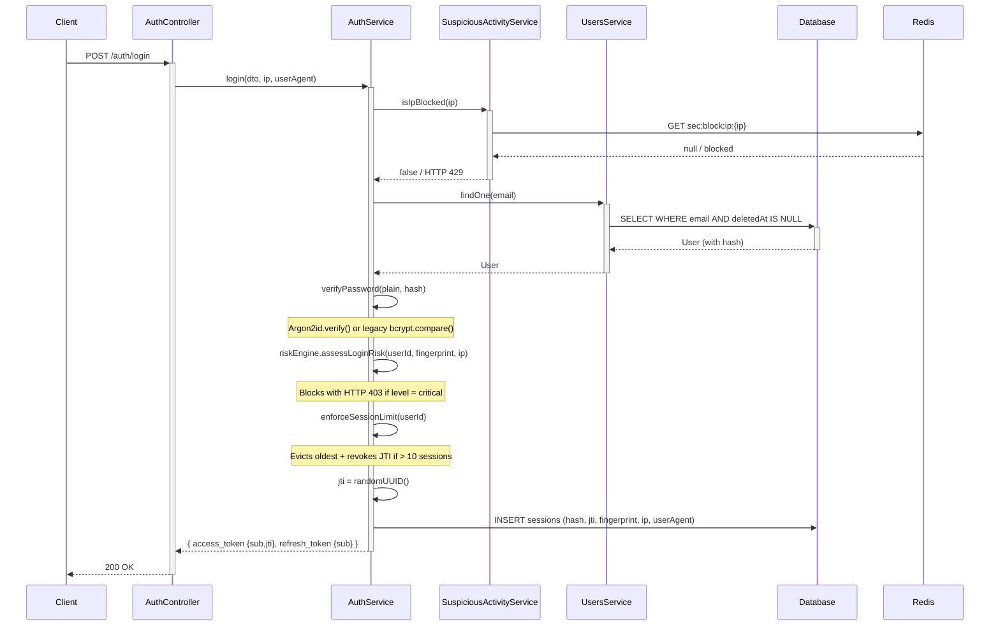

# Authentication

## Overview

The system uses JWT with **RS256**. The private key (`PRIVATE_KEY`) signs tokens; the public key (`PUBLIC_KEY`) verifies. This allows distributing only the public key to services that validate tokens without holding signing capability.

## Token Configuration

| Token | Expiry | Use |
|-------|--------|-----|
| Access token | 15 min | Bearer auth for protected requests |
| Refresh token | 7 days | Obtain new token pair without re-login |

## JWT Payload

Access token (15 min):
- `sub`: User ID
- `jti`: JWT ID — unique UUID per token, used for immediate revocation

Refresh token (7 days):
- `sub`: User ID only

> **Security note:** Email and `roleId` are intentionally excluded from all JWT payloads — this prevents PII leakage via client-side JWT decoding and eliminates stale role claims on the client. `JwtStrategy` always reloads the user from the database on every request; the role is never inferred from the token. Role changes take effect immediately without re-login. The `password` field is always stripped from `req.user`.

## Flows

### Login

1. Client sends email and password to `POST /auth/login`.
2. Server checks IP against the credential stuffing blocklist — if the IP exceeds 20 failures/hour, the request is rejected with HTTP 429 before any user lookup.
3. Server validates credentials — all failure cases return the same `"Invalid credentials"` message to prevent user enumeration.
4. Checks account `isActive = true` and `deletedAt IS NULL` (soft-deleted accounts cannot login).
5. Failed password attempts increment both per-account lockout counter and per-IP suspicious activity counter.
6. On success: the **Risk Engine** scores the login based on device fingerprint, IP history, and account threat signals. A `critical` score blocks the login and revokes all sessions immediately.
7. Session count is enforced (max 10 per user — oldest evicted with JTI revocation if limit is exceeded).
8. A unique `jti` UUID is embedded in the access token and stored in the session row.
9. Returns `access_token` (with JTI) and `refresh_token`. Device fingerprint (full SHA-256 hex of User-Agent + IP) stored with the session.

### Refresh

1. Client sends `refresh_token` to `POST /auth/refresh`.
2. Server validates token (RS256 signature + expiry) and session.
3. If session was revoked (reuse detected), all user sessions are revoked, all associated JTIs are added to the Redis blocklist, and an error is returned.
4. On success: old session revoked, old JTI immediately revoked via Redis; new session with a new `jti` created; returns new token pair.

### Logout

1. Client sends `refresh_token` to `POST /auth/logout` with a valid Bearer token.
2. Server revokes the DB session matching that specific token hash.
3. The session's `accessTokenJti` is immediately added to the Redis blocklist — the access token is invalid from this point on, not just after the 15-minute TTL.

### Rotation and Reuse Detection

- Each refresh invalidates the previous token and its JTI.
- If a revoked refresh token is reused, the system revokes all user sessions, adds all JTIs to the Redis blocklist, and logs `auth.refresh_token_reuse_detected`.
- Session chains are traced for forensic audit purposes.

### JTI Revocation (Redis Blocklist)

Every access token carries a `jti` UUID. On logout, refresh rotation, or password change:
- The JTI is written to Redis as `revoked:jti:{jti}` with TTL equal to the remaining access token lifetime (max 900 seconds).
- `JwtStrategy` performs an O(1) Redis `GET` on every authenticated request — revoked tokens are rejected immediately, even within their 15-minute window.
- If Redis is unavailable, the check fails **open** (token is accepted). This trades strict revocation for availability during Redis outages.

### Session Limits

- Maximum **10 concurrent active sessions** per user.
- On login, if the limit is already reached, the **oldest session is evicted**: its DB record is revoked and its JTI is added to the blocklist.
- Prevents session table flooding from automated attacks or forgotten devices.

### Password Change

- `POST /auth/change-password` requires Bearer auth.
- The request body must include **`currentPassword`** — the current password is verified before any change is applied. This prevents account takeover if an access token is stolen.
- All active session JTIs are collected, then all sessions are revoked in the DB.
- All collected JTIs are added to the Redis blocklist — **all access tokens are immediately invalid**, not just after their TTL.
- Already revoked sessions keep their original `revoked_at` timestamp for audit integrity.
- Event `auth.password.changed` is logged to audit with the count of revoked sessions.
- User must re-login on every device.

## Password Hashing

Passwords are hashed with **Argon2id** (64 MiB, 3 iterations, 4 parallelism). Legacy bcrypt hashes are verified transparently and upgraded to Argon2id on the next successful login — no user action required.

See [Security](./security.md) for full Argon2 parameter rationale.

## Account Lockout and Credential Stuffing Protection

### Per-account lockout
- After **5 failed login attempts**, the account is locked for **15 minutes**.
- Event `auth.account.locked` is logged to audit with the failed attempt count.
- Deactivated or locked users receive `401 Unauthorized`.

### Per-IP credential stuffing detection
- A Redis counter tracks failed login attempts per IP across all accounts (`sec:fail:ip:{ip}`).
- After **20 failures in 1 hour** from the same IP, all login requests from that IP are blocked for **15 minutes** (HTTP 429) — regardless of which account is targeted.
- The counter increments even for nonexistent accounts, preventing enumeration-based stuffing.
- Block events are logged to audit via `SuspiciousActivityService`.

## Rate Limiting

Auth endpoints are protected by two layers of rate limiting:

| Route | Layer 1 (global) | Layer 2 (per-endpoint) |
|-------|-----------------|------------------------|
| `/auth/login` | 300/15min per IP | **5/min per IP** |
| `/auth/refresh` | 300/15min per IP | **10/min per IP** |
| `/auth/logout` | 300/15min per IP | 120/min (default) |
| `/auth/register` | 300/15min per IP | Skipped (admin only) |
| `/auth/change-password` | 300/15min per IP | 120/min (default) |

## Sequence Diagram

## Endpoints

| Method | Route | Auth | Description |
|--------|-------|------|-------------|
| POST | /auth/login | No | Login |
| POST | /auth/refresh | No | Exchange refresh token for new pair |
| POST | /auth/logout | Yes (Bearer) | Revoke current session |
| POST | /auth/register | Yes + perm | Create user (users:create) |
| POST | /auth/change-password | Yes (Bearer) | Change authenticated user password |
