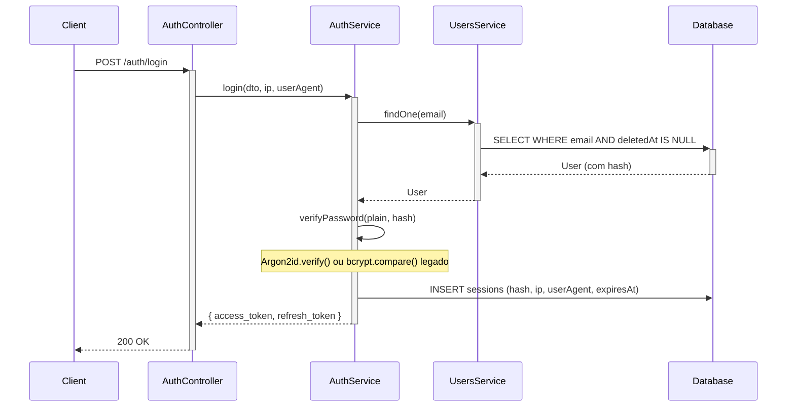

# Autenticação

## Visão Geral

O sistema utiliza JWT com **RS256**. A chave privada (`PRIVATE_KEY`) assina os tokens; a chave pública (`PUBLIC_KEY`) verifica. Assim, apenas a chave pública pode ser distribuída para serviços que validam tokens, sem necessidade de expor a capacidade de assinatura.

## Configuração dos Tokens

| Token | Expiração | Uso |
|-------|-----------|-----|
| Access token | 15 min | Autenticação Bearer em requisições protegidas |
| Refresh token | 7 dias | Obter novo par de tokens sem novo login |

## Payload JWT

- `sub`: ID do usuário
- `email`: E-mail do usuário
- `roleId`: ID da Role atribuída

> **Nota:** O campo `password` é sempre removido do `req.user` antes de ser anexado ao contexto da requisição. O hash nunca fica acessível a controllers ou interceptors.

## Fluxos

### Login

1. Cliente envia email e senha para `POST /auth/login`.
2. Servidor valida credenciais — todos os casos de falha retornam a mesma mensagem `"Invalid credentials"` para evitar enumeração de usuários.
3. Verifica `isActive = true` e `deletedAt IS NULL` (contas excluídas com soft-delete não conseguem fazer login).
4. Em sucesso: retorna `access_token` e `refresh_token`.
5. Hash do refresh token (SHA-256) armazenado em `sessions` com IP e User-Agent.

### Refresh

1. Cliente envia `refresh_token` para `POST /auth/refresh`.
2. Servidor valida token (assinatura RS256 + expiração) e sessão.
3. Se a sessão foi revogada (reutilização detectada), todas as sessões do usuário são revogadas e retorna erro.
4. Em sucesso: nova sessão criada, antiga revogada; retorna novo par de tokens (rotação).

### Logout

1. Cliente envia `refresh_token` para `POST /auth/logout` com token Bearer válido.
2. Servidor revoga a sessão correspondente ao hash daquele token específico.
3. O access token permanece válido até seu TTL de 15 minutos expirar (sem estado por design).

### Rotação e Detecção de Reutilização

- Cada refresh invalida o token anterior.
- Se um refresh token já revogado for reutilizado, o sistema revoga todas as sessões do usuário e registra `auth.refresh_token_reuse_detected`.
- Cadeias de sessão são rastreadas para fins de auditoria forense.

### Alteração de Senha

- `POST /auth/change-password` exige autenticação Bearer.
- Ao alterar a senha, **todas as sessões ativas (não revogadas)** do usuário são revogadas.
- Sessões já revogadas mantêm o `revoked_at` original para preservar a trilha de auditoria.
- O usuário precisa fazer login novamente em cada dispositivo.

## Hash de Senhas

As senhas são protegidas com **Argon2id** (64 MiB, 3 iterações, 4 paralelismo). Hashes bcrypt legados são verificados de forma transparente e atualizados para Argon2id no próximo login bem-sucedido — sem ação necessária do usuário.

Consulte [Segurança](./seguranca.md) para a justificativa completa dos parâmetros do Argon2.

## Bloqueio de Conta

- Após **5 tentativas de login falhas**, a conta é bloqueada por **15 minutos**.
- Evento `auth.account.locked` é registrado na auditoria.
- Usuários desativados ou bloqueados recebem `401 Unauthorized`.

## Rate Limiting

Os endpoints de autenticação são protegidos por duas camadas de rate limiting:

| Rota | Camada 1 (global) | Camada 2 (por endpoint) |
|------|-------------------|-------------------------|
| `/auth/login` | 300/15min por IP | **5/min por IP** |
| `/auth/refresh` | 300/15min por IP | **10/min por IP** |
| `/auth/logout` | 300/15min por IP | 120/min (padrão) |
| `/auth/register` | 300/15min por IP | Ignorado (somente admin) |
| `/auth/change-password` | 300/15min por IP | 120/min (padrão) |

## Diagrama de Sequência

## Endpoints

| Método | Rota | Auth | Descrição |
|--------|------|------|-----------|
| POST | /auth/login | Não | Login |
| POST | /auth/refresh | Não | Trocar refresh token por novo par |
| POST | /auth/logout | Sim (Bearer) | Revogar sessão atual |
| POST | /auth/register | Sim + perm | Criar usuário (users:create) |
| POST | /auth/change-password | Sim (Bearer) | Alterar senha do usuário autenticado |
