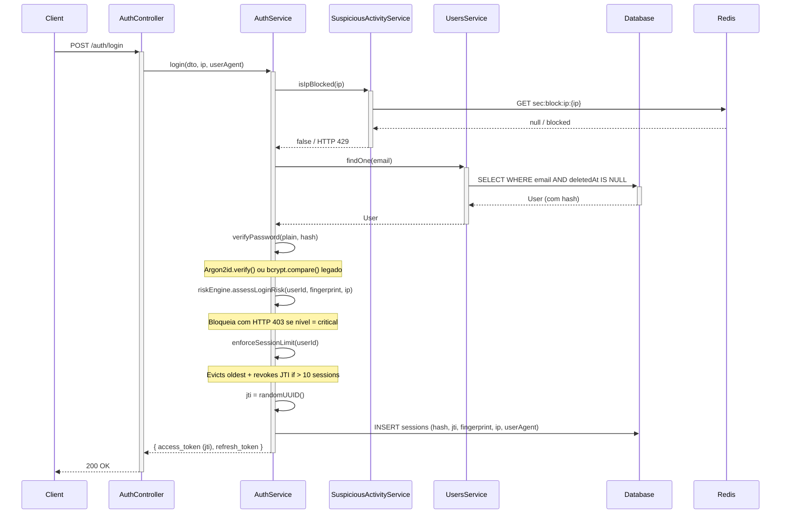

# Autenticação

## Visão Geral

O sistema utiliza JWT com **RS256**. A chave privada (`PRIVATE_KEY`) assina os tokens; a chave pública (`PUBLIC_KEY`) verifica. Assim, apenas a chave pública pode ser distribuída para serviços que validam tokens, sem necessidade de expor a capacidade de assinatura.

## Configuração dos Tokens

| Token | Expiração | Uso |
|-------|-----------|-----|
| Access token | 15 min | Autenticação Bearer em requisições protegidas |
| Refresh token | 7 dias | Obter novo par de tokens sem novo login |

## Payload JWT

- `sub`: ID do usuário
- `email`: E-mail do usuário
- `roleId`: ID da Role atribuída *(carregado apenas para fins informativos — nunca confiado pelo servidor)*
- `jti`: JWT ID — UUID único por token, usado para revogação imediata

> **Nota:** O campo `password` é sempre removido do `req.user`. O `roleId` no claim JWT também nunca é confiado — o `JwtStrategy` sempre recarrega o usuário do banco em cada requisição. Alterações de role têm efeito imediato sem necessidade de novo login.

## Fluxos

### Login

1. Cliente envia email e senha para `POST /auth/login`.
2. Servidor verifica o IP na blocklist de credential stuffing — se o IP excedeu 20 falhas/hora, a requisição é rejeitada com HTTP 429 antes de qualquer busca de usuário.
3. Servidor valida credenciais — todos os casos de falha retornam a mesma mensagem `"Invalid credentials"` para evitar enumeração de usuários.
4. Verifica `isActive = true` e `deletedAt IS NULL` (contas excluídas com soft-delete não conseguem fazer login).
5. Tentativas de senha inválidas incrementam o contador de bloqueio por conta e o contador suspeito por IP.
6. Em sucesso: o **Motor de Risco** pontua o login com base no fingerprint do dispositivo, histórico de IP e sinais de ameaça. Uma pontuação `critical` bloqueia o login e revoga todas as sessões imediatamente.
7. Limite de sessões é aplicado (máximo 10 por usuário — a mais antiga é removida com revogação de JTI se o limite for excedido).
8. Um UUID `jti` único é embutido no access token e armazenado na linha da sessão.
9. Retorna `access_token` (com JTI) e `refresh_token`. Fingerprint do dispositivo (SHA-256 completo em hex de User-Agent + IP) armazenado na sessão.

### Refresh

1. Cliente envia `refresh_token` para `POST /auth/refresh`.
2. Servidor valida token (assinatura RS256 + expiração) e sessão.
3. Se a sessão foi revogada (reutilização detectada), todas as sessões do usuário são revogadas, todos os JTIs associados são adicionados à blocklist do Redis, e retorna erro.
4. Em sucesso: sessão antiga revogada, JTI antigo imediatamente revogado via Redis; nova sessão com novo `jti` criada; retorna novo par de tokens.

### Logout

1. Cliente envia `refresh_token` para `POST /auth/logout` com token Bearer válido.
2. Servidor revoga a sessão no banco correspondente ao hash daquele token específico.
3. O `accessTokenJti` da sessão é imediatamente adicionado à blocklist do Redis — o access token é inválido a partir deste momento, não apenas após o TTL de 15 minutos.

### Rotação e Detecção de Reutilização

- Cada refresh invalida o token anterior e seu JTI.
- Se um refresh token já revogado for reutilizado, o sistema revoga todas as sessões do usuário, adiciona todos os JTIs à blocklist do Redis, e registra `auth.refresh_token_reuse_detected`.
- Cadeias de sessão são rastreadas para fins de auditoria forense.

### Revogação por JTI (Blocklist Redis)

Cada access token carrega um UUID `jti`. No logout, rotação de refresh ou troca de senha:
- O JTI é gravado no Redis como `revoked:jti:{jti}` com TTL igual ao tempo de vida restante do access token (máximo 900 segundos).
- O `JwtStrategy` realiza um `GET` O(1) no Redis em cada requisição autenticada — tokens revogados são rejeitados imediatamente, mesmo dentro da janela de 15 minutos.
- Se o Redis estiver indisponível, a verificação falha **aberta** (token é aceito). Isso prioriza disponibilidade sobre revogação estrita durante falhas do Redis.

### Limite de Sessões

- Máximo de **10 sessões ativas simultâneas** por usuário.
- No login, se o limite já foi atingido, a **sessão mais antiga é removida**: seu registro no banco é revogado e seu JTI é adicionado à blocklist.
- Previne flooding da tabela de sessões por ataques automatizados ou dispositivos esquecidos.

### Alteração de Senha

- `POST /auth/change-password` exige autenticação Bearer.
- O corpo da requisição deve incluir **`currentPassword`** — a senha atual é verificada antes de qualquer alteração. Isso previne tomada de conta se um access token for roubado.
- Todos os JTIs das sessões ativas são coletados, depois todas as sessões são revogadas no banco.
- Todos os JTIs coletados são adicionados à blocklist do Redis — **todos os access tokens são imediatamente inválidos**, não apenas após seu TTL.
- Sessões já revogadas mantêm o `revoked_at` original para preservar a trilha de auditoria.
- Evento `auth.password.changed` é registrado na auditoria com a contagem de sessões revogadas.
- O usuário precisa fazer login novamente em cada dispositivo.

## Hash de Senhas

As senhas são protegidas com **Argon2id** (64 MiB, 3 iterações, 4 paralelismo). Hashes bcrypt legados são verificados de forma transparente e atualizados para Argon2id no próximo login bem-sucedido — sem ação necessária do usuário.

Consulte [Segurança](./seguranca.md) para a justificativa completa dos parâmetros do Argon2.

## Bloqueio de Conta e Proteção Contra Credential Stuffing

### Bloqueio por conta
- Após **5 tentativas de login falhas**, a conta é bloqueada por **15 minutos**.
- Evento `auth.account.locked` é registrado na auditoria com a contagem de tentativas falhas.
- Usuários desativados ou bloqueados recebem `401 Unauthorized`.

### Detecção de credential stuffing por IP
- Um contador Redis rastreia tentativas de login falhas por IP em todas as contas (`sec:fail:ip:{ip}`).
- Após **20 falhas em 1 hora** do mesmo IP, todas as requisições de login desse IP são bloqueadas por **15 minutos** (HTTP 429) — independente de qual conta foi alvo.
- O contador é incrementado mesmo para contas inexistentes, prevenindo credential stuffing baseado em enumeração.
- Eventos de bloqueio são registrados na auditoria via `SuspiciousActivityService`.

## Rate Limiting

Os endpoints de autenticação são protegidos por duas camadas de rate limiting:

| Rota | Camada 1 (global) | Camada 2 (por endpoint) |
|------|-------------------|-------------------------|
| `/auth/login` | 300/15min por IP | **5/min por IP** |
| `/auth/refresh` | 300/15min por IP | **10/min por IP** |
| `/auth/logout` | 300/15min por IP | 120/min (padrão) |
| `/auth/register` | 300/15min por IP | Ignorado (somente admin) |
| `/auth/change-password` | 300/15min por IP | 120/min (padrão) |

## Diagrama de Sequência

## Endpoints

| Método | Rota | Auth | Descrição |
|--------|------|------|-----------|
| POST | /auth/login | Não | Login |
| POST | /auth/refresh | Não | Trocar refresh token por novo par |
| POST | /auth/logout | Sim (Bearer) | Revogar sessão atual |
| POST | /auth/register | Sim + perm | Criar usuário (users:create) |
| POST | /auth/change-password | Sim (Bearer) | Alterar senha do usuário autenticado |
