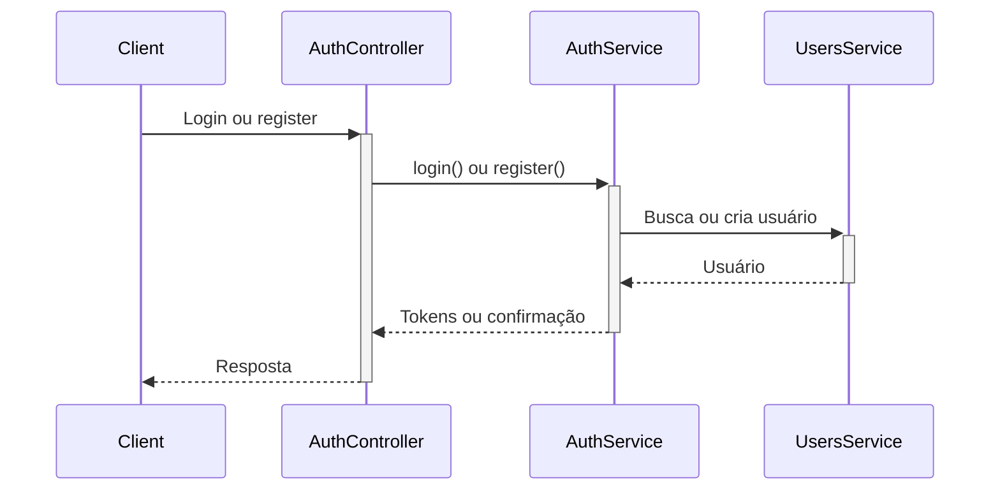

# Autenticação

## Visão geral

O sistema usa JWT com algoritmo **RS256**. A chave privada (`PRIVATE_KEY`) assina os tokens; a chave pública (`PUBLIC_KEY`) verifica. Isso permite distribuir apenas a chave pública para serviços que validam tokens.

## Configuração de tokens

| Token         | Expiração | Uso                                        |
|---------------|-----------|--------------------------------------------|
| Access token  | 15 min    | Autenticação em requisições protegidas     |
| Refresh token | 7 dias    | Obter novo par de tokens sem novo login    |

## Payload JWT

- `sub`: ID do usuário.
- `email`: E-mail do usuário.
- `roleId`: ID da Role atribuída ao usuário.

> **Nota de segurança:** O campo `password` é sempre removido do `req.user`. O hash da senha nunca fica disponível para controllers ou interceptors.

## Hash de Senhas

As senhas são protegidas com **Argon2id**. Hashes bcrypt legados no banco são verificados normalmente e reprocessados com Argon2id de forma transparente no próximo login bem-sucedido — sem ação do usuário.

## Fluxos

### Login
1. Cliente envia email e senha em `POST /auth/login`.
2. Servidor valida credenciais. Todos os casos de falha retornam `"Invalid credentials"` (prevenção de enumeração de usuários).
3. Verifica conta ativa (`isActive = true`) e não excluída (`deletedAt IS NULL`).
4. Em sucesso: retorna `access_token` e `refresh_token`.
5. Refresh token é armazenado em sessão (hash SHA-256) com IP e User-Agent.

### Refresh
1. Cliente envia `refresh_token` em `POST /auth/refresh`.
2. Servidor valida token (RS256) e sessão.
3. Se a sessão foi revogada (ex.: reutilização detectada), todas as sessões do usuário são revogadas e retorna erro.
4. Em sucesso: nova sessão é criada, sessão antiga é revogada; retorna novo par de tokens (rotação).

### Logout
1. Cliente envia `refresh_token` em `POST /auth/logout` com Bearer token válido.
2. Servidor revoga a sessão correspondente ao hash daquele token.
3. O access token permanece válido até seu TTL de 15 minutos (sem estado por design).

### Rotação e detecção de reutilização
- Cada refresh invalida o token anterior (rotação).
- Se um refresh token já revogado for usado (reutilização), o sistema:
  - revoga todas as sessões do usuário;
  - registra evento `auth.refresh_token_reuse_detected` no audit log.

### Mudança de senha
- `POST /auth/change-password` exige autenticação (Bearer).
- Ao alterar a senha, **todas as sessões ativas (não revogadas)** do usuário são revogadas.
- Sessões já revogadas preservam o timestamp original de `revoked_at` para manter a auditoria íntegra.
- O usuário precisa fazer login novamente em cada dispositivo.

## Bloqueio de conta (lockout)

- Após **5 tentativas de login falhas**, a conta é bloqueada por **15 minutos**.
- O evento `auth.account.locked` é registrado no audit log.
- Usuários desativados ou bloqueados recebem `401 Unauthorized`.

## Rate Limiting nos endpoints de Auth

| Rota | Limite por IP |
|------|---------------|
| `POST /auth/login` | **5 req/min** (limiter `auth`) |
| `POST /auth/refresh` | **10 req/min** (limiter `auth`) |
| Demais rotas | 120 req/min (limiter `default`) |

## Diagrama de sequência (login/register)

## Endpoints

| Método | Rota                  | Auth          | Descrição                           |
|--------|-----------------------|---------------|-------------------------------------|
| POST   | /auth/login           | Não           | Login                               |
| POST   | /auth/refresh         | Não           | Trocar refresh por novos tokens     |
| POST   | /auth/logout          | Sim (Bearer)  | Revogar sessão atual                |
| POST   | /auth/register        | Sim + perm    | Criar usuário (users:create)        |
| POST   | /auth/change-password | Sim (Bearer)  | Alterar senha do usuário autenticado|
